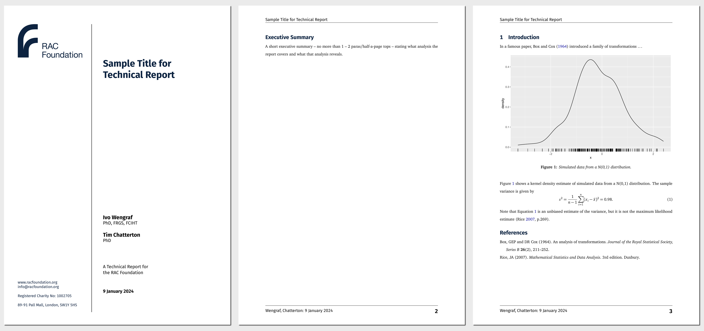

<!-- README.md is generated from README.qmd. Please edit that file -->

# RAC Foundation Technical Report Format Template

This is a Quarto template that assists you in creating an RAC Foundation
technical report.

## Creating a new report

You can use this as a template to create a report. To do this, use the
following command in the terminal window of RStudio (in the
project/folder of your choice):

``` bash
quarto use template numbats/monash-quarto-report
```

This will install the extension and create an example qmd file that you
can use as a starting place for your report.

## Installation for existing document

You may also use this format with an existing Quarto project or
document. From the quarto project or document directory, run the
following command to install this format:

``` bash
quarto install extension numbats/monash-quarto-report
```

## Example

<div>

[](examples/template.pdf)

</div>
